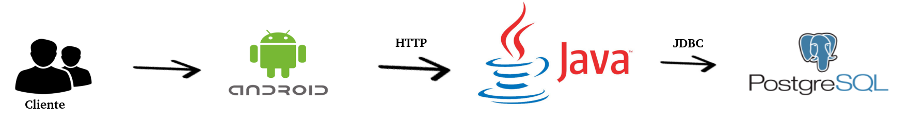
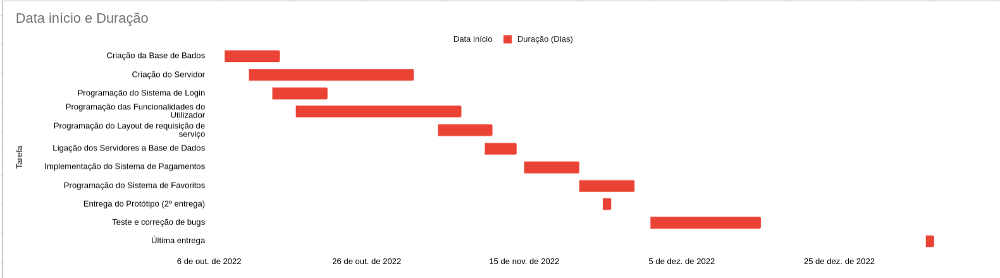

Carolyne Silva - 20210046
Diogo Carvalho -20210008
Marco Antônio Camargo - 20211019

Nome do projeto: Uash App

https://github.com/CMS77/Uash_app

#Descrição da app e do problema

A nossa aplicação visa colmatar a dificuldade que as pessoas têm em arranjar tempo para tratar da limpeza do seu veículo. Embora a limpeza seja uma parte fulcral do bem estar de um condutor, tanto a nível estético, como higiénico, muitas pessoas dão por si sem tempo para tratar desta tarefa, e é aqui que entra a “Uash”!

Descrição dos objetivos e da motivação do trabalho

 O objetivo da nossa aplicação é desenvolver uma plataforma onde as pessoas possam marcar remotamente um serviço de limpeza da sua viatura. Dentro disso existem alguns objetivos que queremos atingir, nomeadamente : 
 - Sistema de login com perfis de utilizador tanto para clientes como para “uashers” ( utilizadores que irão cumprir o serviço da limpeza )
 - Sistema de avaliação destes  “uashers”, onde as pessoas podem pontuar a prestação dos mesmos, com possibilidade de oferecer gorjeta.
 - Sistema de coordenadas GPS para o cliente encontrar o “uasher” mais próximo, discriminar localização da viatura e por fim, encontrar os pontos de lavagem de carros mais próximos.
- FIltros para restringir a procura, tais como : existência de garagem pessoal, possibilidade do carro ser aberto remotamente ou presencialmente, posse de equipamento de limpeza, carta de condução por parte dos “uashers” e preferência por lavagem feita no local ( assumindo garagem ) ou em postos de lavagem.
- Tabulação de preços, com níveis diferentes de serviço

#Público alvo

Visamos atingir um público que, com as dificuldades do dia-a-dia, não tem tempo de sobra para fazer a limpeza dos seus veículos. Temos então algumas opções para nossos utilizadores. 
Aos utilizadores que tem uma garagem privada, onde nossos “uashers” podem realizar o serviço. Neste caso, também será levado em consideração para os utilizadores uma taxa mais adequada à situação.
Levamos também em consideração utilizadores que não possuem garagem em suas casas, o veículo será então levado a um posto de lavagem, onde as taxas de utilização dos postos também serão incluídas na taxa de serviço. 
Outra possibilidade é fazer uma lavagem a seco, onde os utilizadores terão seus veículos estacionados na via. Como esta lavagem não utiliza água, não estará infringindo as leis e será uma opção amiga do meio ambiente.

#Aplicações semelhantes

Encontrámos algumas aplicações/sites, que fornecem serviços semelhantes ou que serviram de inspiração, assim como: Heywash, Sideline, Uber, Glovo, LowClean. As aplicações Heywash, Sideline e LowClean dentro destas são as que mais se aproximam daquilo que envisionámos para a nossa aplicação.
  A aplicação Heywash funciona através de agendamento com um prestador de serviço em que o solicitador da viatura não tem que estar presente. Aquilo que é requisitado do solicitador é que facilite o acesso à chave da viatura, seja por terceiros ( i.e um porteiro que fique com a chave até à chegada do Heywasher ), ou pessoalmente fornecido pelo dono do veículo. Os Heywashers têm que ter material necessário para a lavagem do carro e não dão a hipótese do veículo ser transportado para um posto de lavagem de carros. Eles não têm também em conta se o utilizador que requisita a lavagem do carro tem acesso a uma garagem privada ( ou semelhante ) para cumprir o serviço. Outras diferenças que verificamos são: 
As taxas aplicadas pela Heywash, onde o serviço pode ter acréscimo de valor dependendo da localização e tipo de sujidade que as viaturas apresentem ( i.e lama, lixo, pelos de animais ).
A impossibilidade de recorrer ao mesmo Heywasher ( a seleção é baseada na distância ) 
A proibição de gorjetas a Heywashers ( embora eles façam referência que os Heywashers mais bem avaliados recebem bonificações )
 A aplicação Sideline funciona de uma maneira muito semelhante à Heywash, mas faz da sua maior diferenciação uma lavagem ecológica. O método de recolha de chave é novamente direta ou por terceiros, os operadores da Sideline são obrigados a ter o material de limpeza com eles e aplicam taxas maiores consoante o nível de sujidade da viatura. A uma primeira impressão não demonstram aumentos de preço consoante a zona nem a proibição de bonificações para os seus operadores. Esta aplicação foi contudo menos transparente nos seus serviços, dificultando a aquisição de detalhes sem uma requisição de serviço.
 A aplicação LowClean segue a mesma linha de funcionalidade tendo como especialidade diferentes tipos de lavagem das viaturas. Se verificarmos a sua tabela de preços verificamos uma grande variedade de tipos de limpeza disponíveis, desde a mais básica, propriamente nomeada de “BASIC”, à mais complexa que seria a “SuperDiamante”, com uma valor muito maior do que as anteriores mas com uma atenção ao detalhe redobrada e incluindo lavagem da parte mecânica da viatura, podendo durar até cerca de 8.00h.
 Por fim, a Uber e a Glovo foram a nossa maior inspiração para a nossa aplicação. Sem antes sabermos da existência das outras duas anteriores ( Heywash e Sideline ), foram estas aplicações de requisição de serviços remotos que nos trouxeram esta ideia, em que trabalhadores independentes poderiam agendar serviços através de uma plataforma que fizesse um ponto de ligação para os clientes. Apesar disto, estas aplicações não apresentam estes tipos de serviços, ficando assim apenas como fonte de inspiração e não como concorrência direta.

#Guiões

  Guião A (Requisitar lavagem):

-O utilizador ( cliente ou “uasher ) abre a página inicial da aplicação onde faz o seu login. Se for um utilizador novo, surge a opção de fazer o registo na aplicação. No caso de ser um utilizador novo, é neste passo que define se quer utilizar a aplicação como prestador de serviço ou cliente, e em seguida preenche um formulário onde coloca informações como: nome, nome de utilizador desejado, password e zona de habitação ou possível deslocamento.

-No menu principal, se for cliente, o utilizador deverá selecionar um grande botão de “+” localizado numa barra inferior, e selecionar a opção de requisitar lavagem.

-O cliente digita o endereço desejado para o serviço, os filtros de serviço (lavagem seca, completa, domiciliar, com transporte do veículo, etc), seleciona, ou não, um “uasher” preferencial e recebe a informação de custo do serviço requisitado. Os filtros de serviço podem ser utilizados para especificar seus vários requisitos de tipo de lavagem, local da lavagem, tipo de veículo, etc., e essas podem ser utilizadas para pesquisa por “uashers” interessados.

-O cliente confirma o serviço e insere a informação do cartão de pagamento desejado, e estes pedidos serão depois recebidos nas aplicações dos “uashers” mais próximos ou diretamente para um “uasher” preferencial do cliente; onde serão posteriormente aceites ou recusadas por estes.

-Será então realizado o serviço de acordo com o que foi escolhido.

-Após o serviço o valor é debitado da conta do cliente que recebe uma notificação a confirmar este pagamento e onde pode, se quiser, avaliar a prestação do “uasher” e oferecer uma gorjeta.

Guião B (Oferecer serviço de lavagem):

-O “uasher” faz log-in com a sua conta e indica o equipamento que tem disponível para o fornecimento do serviço e se tem ou não carta de condução no caso de ser necessário transportar o veículo para um posto de limpeza.

-No menu principal, o “uasher” pode aceder aos marcadores no mapa, com a localização dos veículos que requisitaram o serviço e as especificações dos mesmos ( lavagem a seco, posse de garagem própria, etc ) juntamente com informação do valor que irá ganhar com este serviço.

-Se um dos serviços agradar o “uasher” e for aceito por ele, é enviada uma notificação ao cliente para este aceitar o prestador de serviço e é aberta uma janela de chat entre os dois.

-Logo em seguida será então realizado o serviço no local e hora escolhido pelo utilizador.

-Após a conclusão do serviço, o “uasher” dá o serviço como terminado e recebe a sua comissão.

Guião C (Favoritar um “uasher” recente):

-O utilizador faz login na página de login.

-No menu principal, o utilizador carrega num botão com o desenho de uma pessoa numa barra inferior, abrindo o menu de “uashers”.

-O utilizador poderá ver os perfis de todos aqueles com que interagiu recentemente, independente do serviço.

-O utilizador poderá aceder ao perfil do “uasher”, e carregar num botão em formato de estrela.

-O “uasher” selecionado será favoritado, e estará disponível em uma aba especial localizada no menu de utilizadores.

#Solução a implementar

A aplicação "Uash" é baseada num menu principal com acesso a um mapa e a uma aba de serviços, tornando o processo de requisitar uma lavagem, ou aceitar tal serviço, extremamente simples. Também haverá uma funcionalidade de perfis, relacionados cada um a uma conta, permitindo flexibilidade entre os dispositivos de um utilizador, assim como o rápido acesso a contatos frequentes, favoritos, entre outros.

Enquadramento nas diversas Unidades Curriculares

A aplicação será feita no “Android Studio”, relacionado à cadeira de Desenvolvimento Móvel, tais como: mapas por GPS utilizando a biblioteca do Google, notificações e construção de layouts. 

Vamos também utilizar a linguagem de programação “Java 17” na elaboração do nosso projeto que está diretamente ligada à cadeira de Programação Orientada a Objetos. Será então usado o Visual Code para implementação do servidor.

A aplicação terá acesso a uma base de dados para armazenar perfis e suas classificações por outros utilizadores, desenvolvida em conjunto com a sua respectiva cadeira (base de dados). Na implementação da Base de Dados usaremos a linguagem PostgreSQL e PgAdmin para gerenciamento dos dados. 

#Tecnologias a utilizar

PostgresSQL 
PgAdmin 4
Spring  (JPA, Starter, Boot, Security)
Android 
Java 17
Apache Tomcat
Biblioteca de mapa do Google

Com essas tecnologias, segundo o nosso planejamento atual, todos os recursos do app serão possíveis, mesmo que alguns não essenciais possam ser abandonados ou adicionados durante o percurso de elaboração do projeto.

#Arquitetura da Solução 

#Calendarização

#Gráfico de Gantt

Link para planilha e gráfico:   

#Bibliografia.

https://www.heywash.pt/pt
https://sideline.pt/
https://www.lowclean.pt/
https://www.flaticon.com/br/icone-gratis/usuarios-masculinos_17283 
https://www.freepnglogos.com/pics/android-logo 
https://www.sintesys.us/fullscreen-page/comp-jiz1imzz/503b93d4-9b87-4f18-b50f-2c0799522cf9/4/%3Fi%3D4%26p%3Dijdas%26s%3Dstyle-jiz1ikom
https://1000logos.net/postgresql-logo/ 

