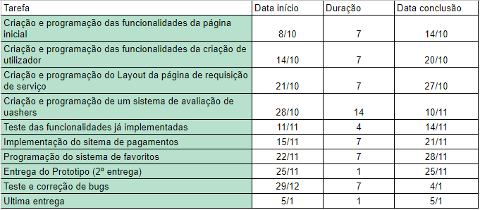

Carolyne Silva - 20210046
Diogo Carvalho -20210008
Marco Antônio Camargo - 20211019

Nome do projeto: Uash App

https://github.com/CMS77/Uash_app

2.  A nossa aplicação visa colmatar a dificuldade que as pessoas têm em arranjar tempo para tratar da limpeza do seu veículo. Embora a limpeza seja uma parte fulcral do bem estar de um condutor, tanto a nível estético, como higiénico, muitas pessoas dão por si sem tempo para tratar desta tarefa, e é aqui que entra a “Uash”!

3. O objetivo da nossa aplicação é desenvolver uma plataforma onde as pessoas possam marcar remotamente um serviço de limpeza da sua viatura. Dentro disso existem alguns objetivos que queremos atingir, nomeadamente : 
 - Sistema de log-in com perfis de utilizador tanto para clientes como para “uashers” ( utilizadores que irão cumprir o serviço da limpeza )
 - Sistema de rating destes  “uashers”, onde as pessoas podem pontuar a prestação dos mesmos, com possibilidade de oferecer gorjeta.
 - Sistema de coordenadas GPS para o cliente encontrar o “uasher” mais próximo, discriminar localização da viatura e por fim, encontrar os pontos de lavagem de carros mais próximos.
- FIltros para restringir a procura, tais como : existência de garagem pessoal, possibilidade do carro ser aberto remotamente ou presencialmente, posse de equipamento de limpeza, carta de condução por parte dos “uashers” e preferência por lavagem feita no local ( assumindo garagem ) ou em postos de lavagem.
- Tabulação de preços, com níveis diferentes de serviço

4. Visamos atingir um público que, com as dificuldades do dia-a-dia, não tem tempo de sobra para fazer a limpeza dos seus veículos. Temos então algumas opções para nossos utilizadores. 
Aos utilizadores que tem uma garagem privada, onde nossos “uashers” podem realizar o serviço. Neste caso, também será levado em consideração para os utilizadores uma taxa mais adequada à situação.
Levamos também em consideração utilizadores que não possuem garagem em suas casas, o veículo será então levado a um posto de lavagem, onde as taxas de utilização dos postos também serão incluídas na taxa de serviço. 
Outra possibilidade é fazer uma lavagem a seco, onde os utilizadores terão seus veículos estacionados na via. Como esta lavagem não utiliza água, não estará infringindo as leis e será uma opção amiga do meio ambiente.

5. Encontrámos algumas aplicações/sites, que fornecem serviços semelhantes ou que serviram de inspiração, assim como: Heywash, Sideline, Uber, Glovo, LowClean. As aplicações Heywash, Sideline e LowClean dentro destas são as que mais se aproximam daquilo que envisionámos para a nossa aplicação.
  A aplicação Heywash funciona através de agendamento com um prestador de serviço em que o solicitador da viatura não tem que estar presente. Aquilo que é requisitado do solicitador é que facilite o acesso à chave da viatura, seja por terceiros ( i.e um porteiro que fique com a chave até à chegada do Heywasher ), ou pessoalmente fornecido pelo dono do veículo. Os Heywashers têm que ter material necessário para a lavagem do carro e não dão a hipótese do veículo ser transportado para um posto de lavagem de carros. Eles não têm também em conta se o utilizador que requisita a lavagem do carro tem acesso a uma garagem privada ( ou semelhante ) para cumprir o serviço. Outras diferenças que verificamos são: 
As taxas aplicadas pela Heywash, onde o serviço pode ter acréscimo de valor dependendo da localização e tipo de sujidade que as viaturas apresentem ( i.e lama, lixo, pelos de animais ).
A impossibilidade de recorrer ao mesmo Heywasher ( a seleção é baseada na distância ) 
A proibição de gorjetas a Heywashers ( embora eles façam referência que os Heywashers mais bem avaliados recebem bonificações )
 A aplicação Sideline funciona de uma maneira muito semelhante à Heywash, mas faz da sua maior diferenciação uma lavagem ecológica. O método de recolha de chave é novamente direta ou por terceiros, os operadores da Sideline são obrigados a ter o material de limpeza com eles e aplicam taxas maiores consoante o nível de sujidade da viatura. A uma primeira impressão não demonstram aumentos de preço consoante a zona nem a proibição de bonificações para os seus operadores. Esta aplicação foi contudo menos transparente nos seus serviços, dificultando a aquisição de detalhes sem uma requisição de serviço.
 A aplicação LowClean segue a mesma linha de funcionalidade tendo como especialidade diferentes tipos de lavagem das viaturas. Se verificarmos a sua tabela de preços verificamos uma grande variedade de tipos de limpeza disponíveis, desde a mais básica, propriamente nomeada de “BASIC”, à mais complexa que seria a “SuperDiamante”, com uma valor muito maior do que as anteriores mas com uma atenção ao detalhe redobrada e incluindo lavagem da parte mecânica da viatura, podendo durar até cerca de 8.00h.
 Por fim, a Uber e a Glovo foram a nossa maior inspiração para a nossa aplicação. Sem antes sabermos da existência das outras duas anteriores ( Heywash e Sideline ), foram estas aplicações de requisição de serviços remotos que nos trouxeram esta ideia, em que trabalhadores independentes poderiam agendar serviços através de uma plataforma que fizesse um ponto de ligação para os clientes. Apesar disto, estas aplicações não apresentam estes tipos de serviços, ficando assim apenas como fonte de inspiração e não como concorrência direta.

6.  Guião A (Requisitar lavagem):

O utilizador faz o cadastro no inicio da sessão com o seu email e senha,
No menu principal, o utilizador aperta um grande botão de “+” em uma barra inferior, e seleciona a opção de requisitar lavagem,
O utilizador digita o endereço desejado e as “tags” de serviço (lavagem seca, completa, domiciliar, com transporte do veículo, etc), e o preço máximo desejado,
O utilizador confirma o serviço. Estas ofertas serão enviadas para os “uashers” mais próximos, e aceitas pelo dono do veículo no menu principal.

Guião B (Oferecer serviço de lavagem):

O utilizador faz o cadastro com o seu email e senha, nesta etapa será necessário cumprir com os requisitos, (confirmar se tem o material para a lavagem, carta de condução se for necessário a deslocação do veículo, etc.)
No menu principal, o “uashers” pode aceder aos marcadores no mapa, com a localização dos veículos que requisitaram o serviço e o preço oferecido,
Ao fazer isso, o “uashers” poderá fazer uma oferta com o preço do seu serviço,
Caso a oferta seja aceita, o “uashers” entrará em uma conversa com o utilizador, e direções em GPS serão exibidas.

Guião C (Favoritar um “uasher” recente):

O utilizador faz login na página de login,
No menu principal, o utilizador aperta um botão com o desenho de uma pessoa em uma barra inferior, abrindo o menu de “uashers”,
O utilizador poderá ver os perfis de todos aqueles com que interagiu recentemente, independente do serviço,
O utilizador poderá aceder ao perfil do “uashers”, e apertar em um botão em formato de estrelinha,
O “uashers” selecionado será favoritado, e estará disponível em uma aba especial no menu de utilizadores.

7. O aplicativo "Uash", com o objetivo de oferecer um serviço rápido, prático, eficiente e completo, seguirá uma filosofia de design centralizada e inteligente, baseada em um menu principal com acesso à um mapa e aba de serviços, tornando o processo de requisitar uma lavagem, ou aceitar tal serviço, extremamente simples. Também haverá uma funcionalidade de perfis, relacionados cada um à uma conta, permitindo flexibilidade entre os dispositivos de um utilizador, assim como o rápido acesso a contatos frequentes, favoritos, etc..

Com esses objetivos, há um requisito de várias tecnologias diferentes a serem utilizadas. O aplicativo será feito no Android Studio, relacionado às cadeiras de Desenvolvimento Móvel e Programação Orientada à Objetos, por fornecer fácil acesso à diversas funcionalidades - principalmente para o Uash: mapas por GPS, notificações, e base de dados externas. O aplicativo fará acesso à uma base de dados para armazenar perfis e suas classificações por outros utilizadores, desenvolvida em conjunto com a sua respectiva cadeira. Com essas tecnologias, segundo nosso planejamento atual, todos os recursos do app serão possíveis; mesmo que alguns não-essenciais possam ser abandonados.

8. 

Link para planilha e gráfico:  

9. Bibliografia.

https://www.heywash.pt/pt
https://sideline.pt/
https://www.lowclean.pt/

